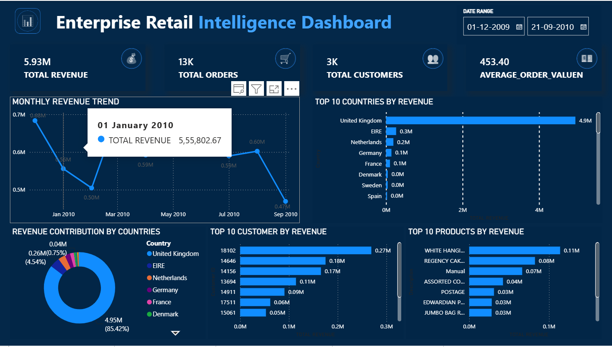
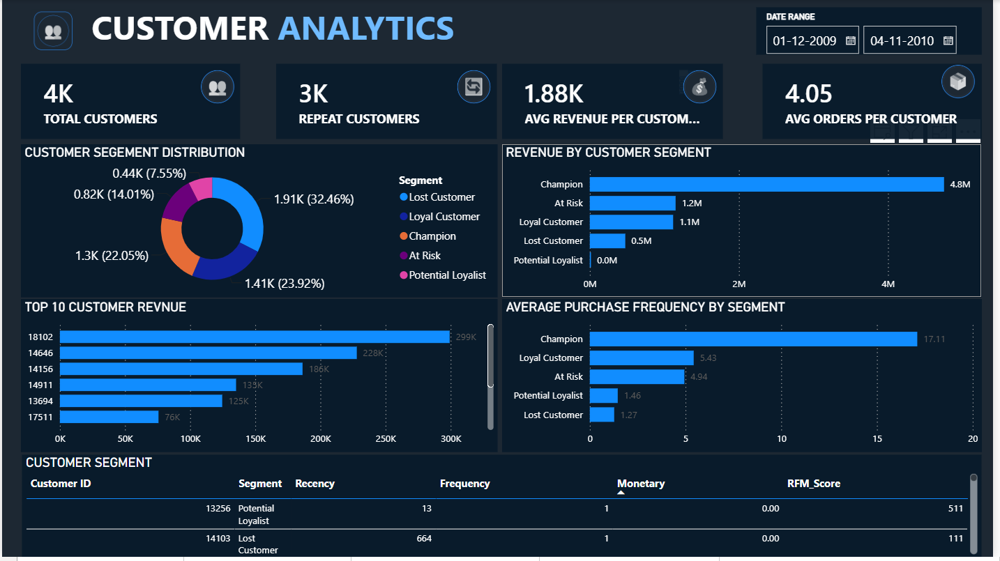
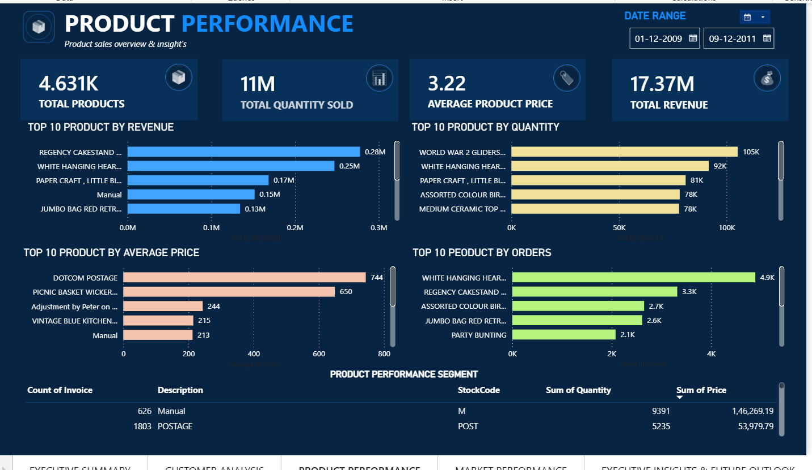
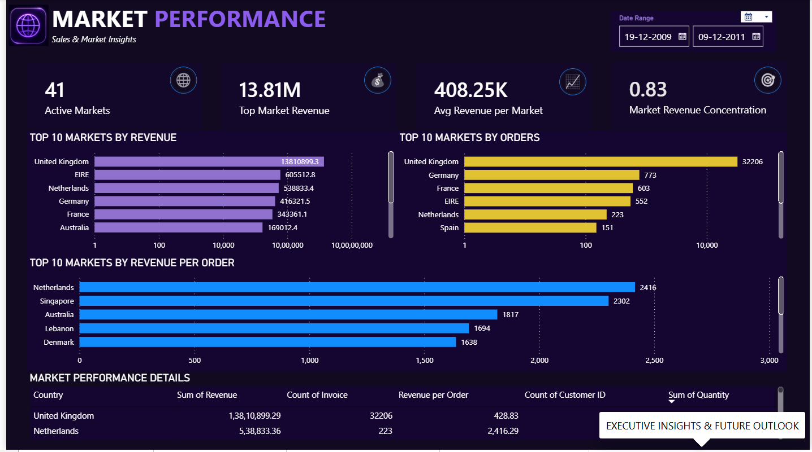
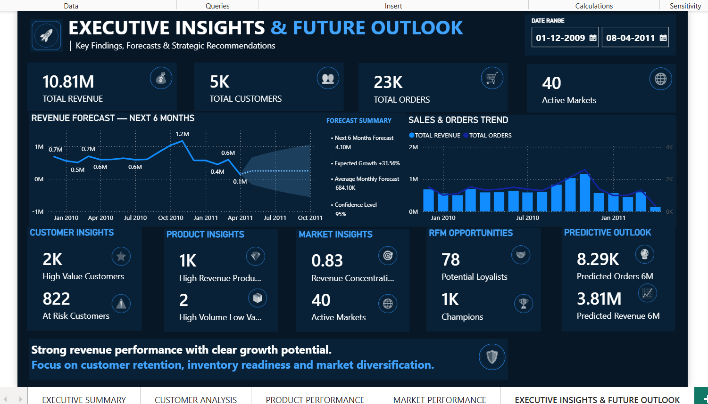

<div align="center">

# 📊 ENTERPRISE RETAIL INTELLIGENCE PLATFORM

### End-to-End Retail Analytics, Business Intelligence & Predictive Analytics

<p>


</p>

</div>

---

# 📌 PROJECT OVERVIEW

The **Enterprise Retail Intelligence Platform** is an end-to-end data analytics and business intelligence project built to transform raw retail transaction data into actionable business insights.

The project combines:

- Data understanding
- Data cleaning
- Exploratory Data Analysis
- SQL business analysis
- RFM customer segmentation
- Power BI data modeling
- DAX-based KPI development
- Interactive dashboarding
- Market intelligence
- Product intelligence
- Customer intelligence
- Predictive revenue and order forecasting

The final solution provides both **historical business analysis** and a **forward-looking predictive outlook**.

---

# 🎯 BUSINESS PROBLEM

Retail organizations generate large volumes of transactional data containing information about customers, products, orders, revenue, and markets.

However, raw transactional data alone does not provide clear answers to important business questions.

The objective of this project is to transform transactional retail data into an interactive intelligence platform that helps stakeholders understand:

- What is happening in the business?
- Which customers are most valuable?
- Which customers are at risk?
- Which products drive revenue and demand?
- Which markets contribute the most revenue?
- Where is revenue concentrated?
- What opportunities exist for growth?
- What could future revenue and order demand look like?

---

# 🎯 BUSINESS OBJECTIVES

The project focuses on:

- Monitoring overall sales performance
- Tracking revenue and order trends
- Understanding customer behavior
- Identifying high-value customers
- Identifying at-risk customers
- Segmenting customers using RFM analysis
- Identifying high-performing products
- Understanding product demand
- Comparing market performance
- Measuring market revenue concentration
- Supporting inventory readiness
- Supporting market and logistics decisions
- Forecasting future revenue
- Forecasting future order demand
- Converting analytical findings into business recommendations

---

# 🛠️ TECHNOLOGY STACK

<div align="center">

| Technology | Purpose |
|---|---|
| **Python** | Data understanding, cleaning, EDA & analytics |
| **SQL** | Business analysis & data querying |
| **Power BI** | Interactive dashboard & visualization |
| **Power Query** | Data transformation |
| **DAX** | KPI calculations & analytical measures |
| **RFM Analysis** | Customer segmentation |
| **Data Modeling** | Relationship & analytical model |
| **Predictive Analytics** | Future revenue & order forecasting |

</div>

---

# 📂 PROJECT STRUCTURE

```text
Enterprise Retail Intelligence Platform/
│
├── data/
│
├── notebook/
│   ├── 01_understand_data.ipynb
│   ├── 02_data_cleaning.ipynb
│   ├── 03_exploratory_data_analysis.ipynb
│   ├── 04_rfm_customer_segmentation.ipynb
│   ├── 05_sql_business_analysis.ipynb
│   └── retail.db
│
├── Powerbi/
│   └── Enterprise_Retail_Intelligence_Dashboard.pbix
│
├── report/
│   ├── Enterprise Retail Intelligence Dashboard.docx
│   └── Enterprise Retail Intelligence Dashboard.pdf
│
├── screenshots/
│   ├── 01_EXECUTIVE_SUMMARY.png
│   ├── 02_CUSTOMER_ANALYTICS.png
│   ├── 03_PRODUCT_PERFORMANCE.png
│   ├── 04_MARKET_PERFORMANCE.png
│   └── 05_PREDICTIVE.png
│
├── SQL/
│
├── src/
│
├── Visuals/
│
├── .gitignore
│
├── README.md
│
└── requirements.txt
```

---

# 🔄 ANALYTICS WORKFLOW

```text
Raw Retail Data
       ↓
Data Understanding
       ↓
Data Cleaning & Transformation
       ↓
Exploratory Data Analysis
       ↓
SQL Business Analysis
       ↓
RFM Customer Segmentation
       ↓
Power BI Data Modeling
       ↓
DAX Measures & KPIs
       ↓
Interactive Dashboard
       ↓
Predictive Forecasting
       ↓
Business Insights
       ↓
Strategic Recommendations
```

---

# 📊 DASHBOARD PAGES

## 1️⃣ EXECUTIVE SUMMARY

Provides an executive-level overview of business performance.

### Key KPIs

- Total Revenue
- Total Orders
- Total Customers
- Average Order Value

### Analysis

- Monthly Revenue Trend
- Top Countries by Revenue
- Revenue Contribution by Country
- Top Customers by Revenue
- Top Products by Revenue

<div align="center">



</div>

---

# 👥 2️⃣ CUSTOMER ANALYTICS

The Customer Analytics page focuses on customer behavior, value, and segmentation.

### Key Analysis

- Total Customers
- Repeat Customers
- Average Revenue per Customer
- Average Orders per Customer
- Customer Segment Distribution
- Revenue by Customer Segment
- Top Customers by Revenue
- Average Purchase Frequency by Segment
- Customer-Level RFM Details

### RFM Segments

- Champions
- Loyal Customers
- Potential Loyalists
- At Risk
- Lost Customers

<div align="center">



</div>

---

# 📦 3️⃣ PRODUCT PERFORMANCE

The Product Performance page evaluates product-level sales and demand.

### Key KPIs

- Total Products
- Total Quantity Sold
- Average Product Price
- Total Revenue

### Analysis

- Top Products by Revenue
- Top Products by Quantity
- Top Products by Average Price
- Top Products by Order Count
- Product Performance Details

These insights can support:

- Inventory planning
- Replenishment
- Product prioritization
- Demand monitoring
- Pricing decisions

<div align="center">



</div>

---

# 🌍 4️⃣ MARKET PERFORMANCE

The Market Performance page evaluates geographic business performance.

### Key KPIs

- Active Markets
- Top Market Revenue
- Average Revenue per Market
- Market Revenue Concentration

### Analysis

- Top Markets by Revenue
- Top Markets by Orders
- Top Markets by Revenue per Order
- Market Performance Details

These insights can support:

- Market prioritization
- Geographic expansion
- Distribution planning
- Logistics optimization
- Revenue diversification

<div align="center">



</div>

---

# 🔮 5️⃣ PREDICTIVE ANALYTICS & FUTURE OUTLOOK

The final page combines historical performance with forward-looking analytics.

### Key Areas

- Revenue Forecast
- Sales & Orders Trend
- Customer Insights
- Product Insights
- Market Insights
- RFM Opportunities
- Predictive Outlook
- Strategic Recommendations

### Predictive KPIs

- Predicted Revenue — Next 6 Months
- Predicted Orders — Next 6 Months
- Expected Growth
- Average Monthly Forecast
- 95% Confidence Level

<div align="center">



</div>

---

# 🧹 DATA PREPARATION

The project includes a dedicated data preparation workflow.

### Key Activities

- Understanding the dataset
- Identifying data types
- Handling missing values
- Handling invalid transactions
- Cleaning transactional records
- Preparing date fields
- Creating revenue-related fields
- Creating Month Year
- Creating Month Sort
- Preparing customer-level data
- Preparing RFM analysis data

---

# 🔍 EXPLORATORY DATA ANALYSIS

EDA was performed to understand the underlying retail business patterns before dashboard development.

The analysis focused on:

- Revenue distribution
- Order patterns
- Customer behavior
- Product performance
- Country-level performance
- Quantity trends
- Price patterns
- Customer purchasing behavior

EDA helped identify the most relevant business metrics and visualizations for the final dashboard.

---

# 🧑‍🤝‍🧑 RFM CUSTOMER SEGMENTATION

RFM analysis was implemented using three dimensions:

### Recency

Measures how recently a customer made a purchase.

### Frequency

Measures how frequently a customer purchased.

### Monetary

Measures the revenue generated by a customer.

These dimensions were converted into RFM scores and used to create meaningful customer segments.

### Business Use

RFM segmentation helps identify:

- High-value customers
- Loyal customers
- Potential loyalists
- Customers at risk
- Lost customers

This supports targeted retention and customer engagement strategies.

---

# 🗄️ SQL BUSINESS ANALYSIS

SQL analysis was performed to answer business-oriented questions from the retail database.

The SQL workflow supports analysis such as:

- Revenue by country
- Customer-level revenue
- Product performance
- Order analysis
- Market performance
- Customer purchasing behavior
- Business ranking and aggregation

The SQL analysis complements the Python and Power BI workflow.

---

# 📐 DATA MODEL

The Power BI model connects the cleaned retail transaction data with the customer-level RFM segmentation data.

### Main Transaction Table

`cleaned_online_retail`

Important fields include:

- Invoice
- InvoiceDate
- Customer ID
- Country
- Description
- Quantity
- Price
- Revenue

### RFM Table

`rfm_customer_segments`

Important fields include:

- Customer ID
- Recency
- Frequency
- Monetary
- RFM Score
- Segment

### Relationship

The two tables are connected using:

```text
cleaned_online_retail[Customer ID]
              ↓
rfm_customer_segments[Customer ID]
```

This allows customer segmentation to work together with transactional analysis.

---

# 📊 KEY DAX MEASURES

The dashboard uses DAX measures to create dynamic business KPIs.

Important measures include:

```text
TOTAL REVENUE
TOTAL ORDERS
TOTAL CUSTOMERS
TOTAL QUANTITY
AVERAGE ORDER VALUE
AVG REVENUE PER CUSTOMER
AVG ORDERS PER CUSTOMER
REVENUE PER ORDER
TOP MARKET REVENUE
MARKET REVENUE CONCENTRATION
HIGH VALUE CUSTOMERS
AT RISK CUSTOMERS
CHAMPIONS
POTENTIAL LOYALISTS
PREDICTED REVENUE 6M
PREDICTED ORDERS 6M
```

### Order Calculation

Orders are calculated using distinct invoices rather than transaction rows:

```DAX
TOTAL ORDERS =
DISTINCTCOUNT(cleaned_online_retail[Invoice])
```

This prevents multiple product lines belonging to the same invoice from being counted as separate orders.

---

# 📅 INTERACTIVE DATE ANALYSIS

The dashboard contains an interactive **Invoice Date** slicer.

Changing the date range dynamically updates the relevant:

- KPIs
- Revenue trends
- Order trends
- Customer metrics
- Market metrics
- Product metrics
- RFM insights
- Predictive metrics

This allows users to investigate business performance across different periods.

---

# 🔮 PREDICTIVE ANALYTICS

The dashboard includes a six-month revenue and order forecast.

The predictive layer provides:

- Future Revenue Estimate
- Future Order Estimate
- Expected Growth
- Average Monthly Forecast
- Confidence Interval

The forecast helps stakeholders move from:

```text
Historical Reporting
        ↓
Current Performance
        ↓
Future Outlook
```

This makes the dashboard useful for forward-looking planning.

---

# ❓ KEY BUSINESS QUESTIONS

## Sales

- How is revenue performing?
- How are orders trending?
- What is the average order value?

## Customers

- Which customers generate the most revenue?
- Which customers are high-value?
- Which customers are at risk?
- Which segments have the highest purchase frequency?

## Products

- Which products generate the most revenue?
- Which products have the highest quantity sold?
- Which products have the highest order count?
- Which products require inventory attention?

## Markets

- Which markets generate the most revenue?
- Which markets generate the most orders?
- Which markets have the highest revenue per order?
- How concentrated is revenue across markets?

## Future

- What could revenue look like over the next six months?
- What could order demand look like?
- How can predictive insights support planning?

---

# 💡 BUSINESS INSIGHTS

The platform converts analytical results into four major insight areas.

### 👥 CUSTOMER INSIGHTS

Identify high-value customers and customers at risk of churn so that retention strategies can be prioritized.

### 📦 PRODUCT INSIGHTS

Identify revenue-driving and high-demand products to support inventory and product planning.

### 🌍 MARKET INSIGHTS

Identify dominant markets and revenue concentration to support geographic prioritization and diversification.

### 🔮 PREDICTIVE INSIGHTS

Use future revenue and order forecasts to support forward-looking business planning.

---

# 💼 STRATEGIC RECOMMENDATIONS

## 🛡️ PROTECT

Focus on retaining valuable customers and protecting strong revenue-generating markets.

Recommended actions:

- Strengthen loyalty programs
- Target high-value customers
- Develop retention campaigns
- Monitor at-risk customers

---

## 📈 GROW

Use high-performing products and customer segments to drive additional revenue.

Recommended actions:

- Promote high-revenue products
- Cross-sell to valuable customers
- Optimize product strategy
- Monitor demand patterns

---

## 🌍 EXPAND

Explore opportunities beyond highly concentrated markets.

Recommended actions:

- Evaluate emerging markets
- Develop localized campaigns
- Improve distribution
- Optimize logistics

---

## 📦 INVENTORY & LOGISTICS

Combine product demand, order trends, and predictive insights to improve operational planning.

Potential applications:

- Inventory readiness
- Replenishment planning
- Demand monitoring
- Stock-out risk reduction
- Logistics capacity planning

---

# 📈 BUSINESS IMPACT

The platform provides a centralized view of retail performance and enables stakeholders to move from raw data to business action.

```text
DATA
 ↓
ANALYSIS
 ↓
INSIGHTS
 ↓
PREDICTION
 ↓
BUSINESS ACTION
```

The solution supports both:

**Operational Decision-Making**

and

**Strategic Business Planning**

---

# 🧠 PROJECT LEARNINGS

This project provided practical experience in:

- Data cleaning
- Data transformation
- Exploratory Data Analysis
- Python analytics
- SQL business analysis
- Power Query
- Power BI
- Data modeling
- DAX
- KPI development
- RFM customer segmentation
- Customer analytics
- Product analytics
- Market analytics
- Predictive forecasting
- Dashboard design
- Business storytelling
- Translating data into recommendations

---

# 📁 REPOSITORY CONTENT

| Folder / File | Description |
|---|---|
| `data/` | Dataset and data resources |
| `notebook/` | Python analysis notebooks |
| `retail.db` | SQLite database used for SQL analysis |
| `Powerbi/` | Final Power BI dashboard |
| `report/` | Project case study in DOCX and PDF |
| `screenshots/` | Dashboard page screenshots |
| `SQL/` | SQL analysis resources |
| `src/` | Supporting source code |
| `Visuals/` | Supporting visual assets |
| `requirements.txt` | Python dependencies |
| `README.md` | Project documentation |

---

# 🚀 PROJECT OUTCOME

The final solution is an **Enterprise Retail Intelligence Platform** combining:

**Python + SQL + Power BI + DAX + RFM Analysis + Predictive Analytics**

into one end-to-end analytical workflow.

The project demonstrates the ability to:

**Understand → Clean → Analyze → Model → Visualize → Predict → Recommend**

and convert raw retail transaction data into a business-focused decision-support solution.

---

# 👤 AUTHOR

<div align="center">

### Data Analyst Portfolio Project

**Enterprise Retail Intelligence Platform**

Power BI • Python • SQL • DAX • Power Query • RFM Analysis • Predictive Analytics • Business Intelligence

</div>

---

<div align="center">

### ⭐ From Raw Data to Business Intelligence

**Analyze • Understand • Predict • Act**

</div>
````
